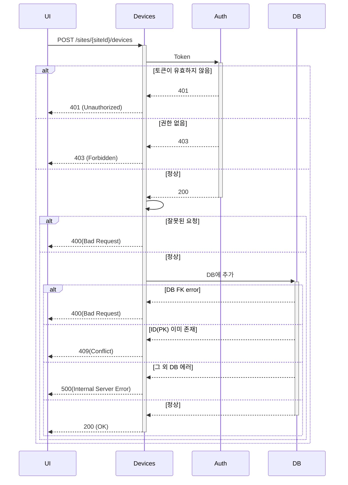
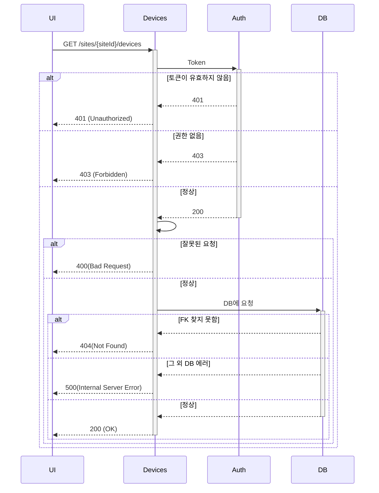
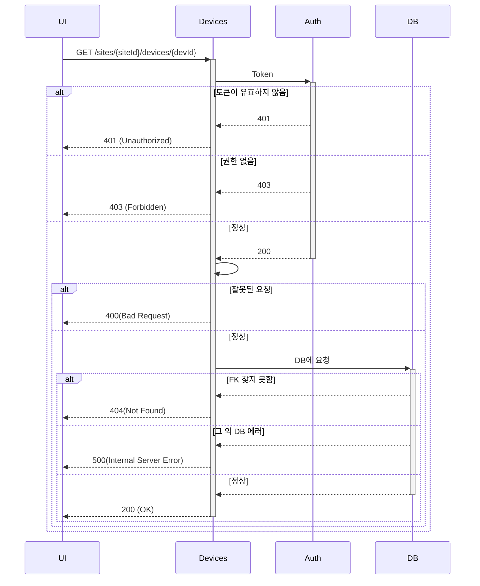
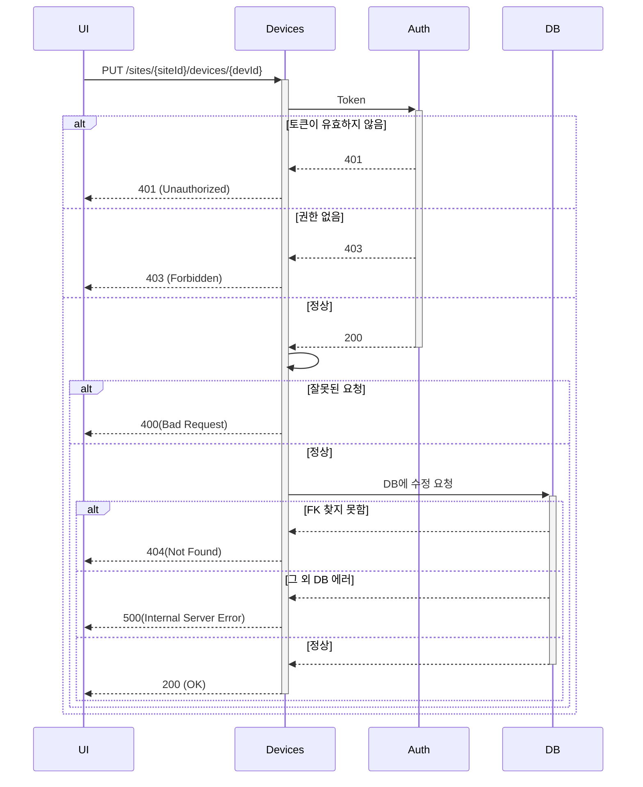
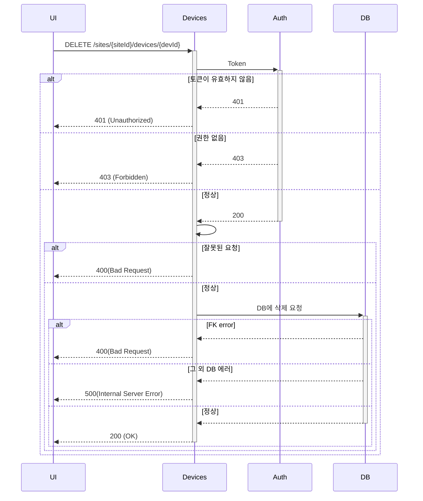

### 시퀀스 다이어그램 참고 (직접 생각한거라 틀릴 수 있음)

#### Create

#### Get List

#### Get Specific Information

#### Edit 

#### Delete

### 이슈 (생각해야하는 시나리오)

1. 추가하려 하는데 DB에 이미 PK가 존재한다

    - 409 conflict error

 

2. 추가하려 하는데 이미 삭제된 상태이다.(조회 api를 날리면 404가 떨어지는 상태)

    - 어떻게 해야할지 - 409는 쓰면 안됨(의미가 다른데 같은 에러 떨구면 안된다)

 

3. 삭제된 상태인데 다시 이전 정보를 살리고 싶다.

    - UPDATE로 Delete Status F로 바꾸면 됨