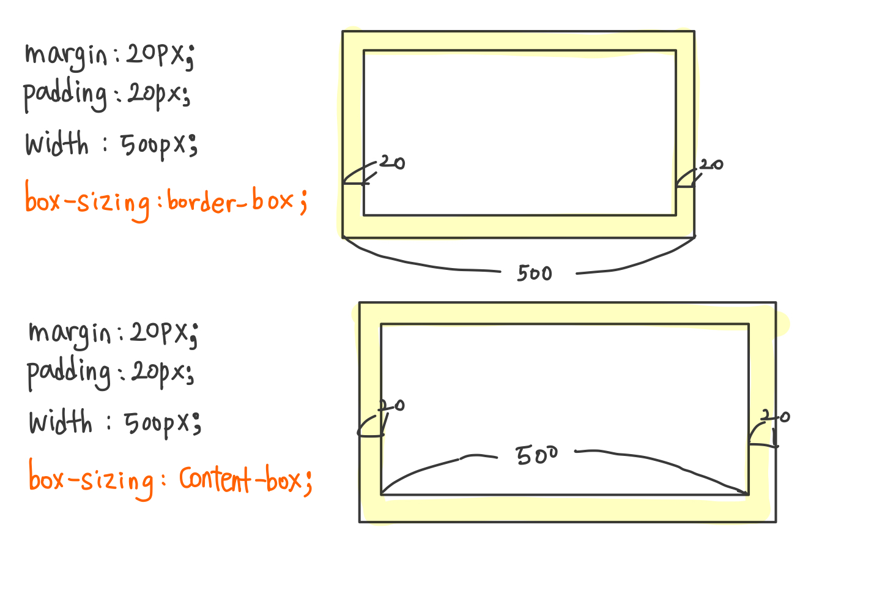

## box-sizing 속성

박스의 크기를 어떤 것을 기준으로 계산할지 정하는 속성

- default: content-box
- 상속: no
- 애니메이션: no
   

**문법**  
`box-sizing: content-box | border-box | initial | inherit `

- content-box: 콘텐츠 영역을 기준으로 크기 정함
- border-box: 테두리를 기준으로 크기를 정함
- initial: 기본값으로 설정
- inherit: 부모 요소의 속성값 상속 받음

ex)  

