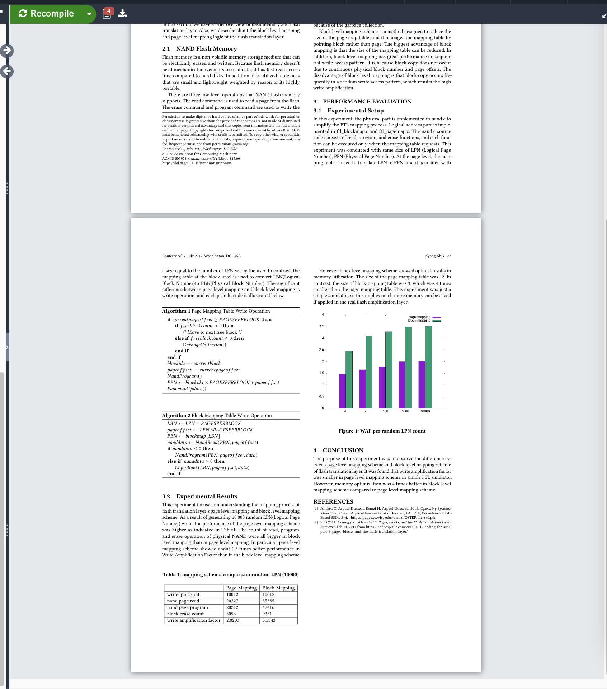

### Bar Chart

#### Data 준비

data.dat

```
x y1 y2
20 1.488 2.488
50 1.6613 3.0968
100 1.7768 3.2946
1000 1.9990 3.5010
10000 2.0203 3.5343
```

<br/>

#### gnuplot으로 png 파일 뽑아냄

```shell
gnuplot

gnuplot> set terminal png
gnuplot> set output 'output.png'
gnuplot> set style data histogram
gnuplot> set style histogram cluster gap 1
gnuplot> set style fill solid border rgb "black"
gnuplot> set auto x
gnuplot> set yrange[0:*]
gnuplot> plot 'data.dat' using 2:xtic(1) title col, \
>'' using 3:xtic(1) title col

```

<br/>

#### 결과 png 파일을 eps 파일로 변환

https://image.online-convert.com/convert-to-eps

<Br/>

#### Latex 안에 삽입

```Latex
\begin{figure}[h]
    \centering
    \includegraphics[width=\linewidth]{output.eps}
    \label{fig:my_label}
    \caption{ page level mapping WAF }
\end{figure}
```

#### 결과


